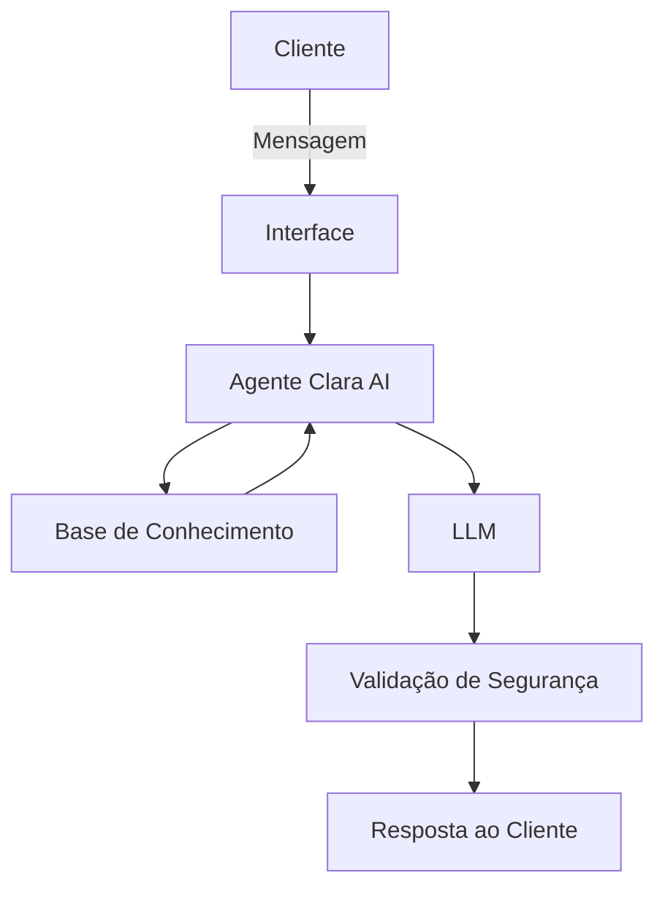

# Documentação do Agente

## Caso de Uso

### Problema
> Qual problema financeiro seu agente resolve?

Grande parte das pessoas possui dificuldades em compreender e administrar suas finanças pessoais, principalmente no acompanhamento contínuo de gastos, planejamento financeiro e tomada de decisões relacionadas a investimentos.

Normalmente, o controle financeiro ocorre de forma reativa, quando o usuário já enfrenta problemas como excesso de despesas, falta de organização orçamentária ou escolhas financeiras inadequadas. Além disso, serviços especializados de consultoria financeira costumam possuir alto custo, limitando o acesso da população a orientações personalizadas.

Dessa forma, existe a necessidade de uma solução acessível que auxilie o usuário de maneira contínua, personalizada e preventiva.

### Solução
> Como o agente resolve esse problema de forma proativa?

A Clara AI é uma agente financeira inteligente baseada em IA Generativa que atua como uma assistente financeira pessoal digital.

O agente resolve o problema de forma proativa por meio de:

- Análise automática do histórico de transações financeiras do usuário;

- Identificação de padrões de consumo e variações de gastos;

- Geração de alertas preventivos sobre possíveis desequilíbrios financeiros;

- Sugestões personalizadas alinhadas ao perfil do investidor;

- Interação conversacional natural para esclarecimento de dúvidas financeiras.

Diferentemente de chatbots tradicionais, a Clara AI antecipa necessidades financeiras e oferece recomendações antes que problemas ocorram, promovendo educação financeira contínua.

### Público-Alvo
> Quem vai usar esse agente?

O agente é destinado a:

- Pessoas que desejam melhorar o controle das finanças pessoais;

- Usuários iniciantes em planejamento financeiro e investimentos;

- Clientes que buscam orientação financeira acessível e personalizada;

- Indivíduos interessados em acompanhar gastos e metas financeiras de forma automatizada.

---

## Persona e Tom de Voz

### Nome do Agente
Clara AI — Assistente Financeira Inteligente

### Personalidade
> Como o agente se comporta? (ex: consultivo, direto, educativo)

A Clara AI apresenta comportamento:

- Consultivo e educativo;

- Proativo na identificação de melhorias financeiras;

- Analítico, baseado em dados do usuário;

- Empático e orientado ao apoio contínuo;

- Responsável e cauteloso em recomendações financeiras.

O agente atua como uma assistente pessoal que auxilia o usuário a compreender melhor sua situação financeira e tomar decisões mais conscientes.

### Tom de Comunicação
> Formal, informal, técnico, acessível?

O tom de comunicação da Clara AI é:

- Profissional e acessível;

- Amigável e humanizado;

- Educativo, evitando termos excessivamente técnicos;

- Claro e objetivo nas recomendações.

O objetivo é transmitir confiança e proximidade, facilitando o entendimento mesmo para usuários sem conhecimento financeiro avançado.

### Exemplos de Linguagem
- Saudação: "Olá! Eu sou a Clara AI 😊. Vamos analisar suas finanças e encontrar oportunidades para melhorar seu planejamento?"
- Confirmação: "Entendi sua solicitação. Vou analisar seus dados financeiros para oferecer a melhor orientação possível."
- Erro/Limitação: "No momento não encontrei informações suficientes na base de dados para responder com segurança, mas posso ajudar analisando outros aspectos das suas finanças."

---

## Arquitetura

### Diagrama

### Componentes

| Componente | Descrição |
|------------|-----------|
| Interface | Chat interativo desenvolvido em Streamlit para comunicação em linguagem natural com o usuário |
| LLM | Modelo de Linguagem executado localmente via Ollama (ex: Llama 3) |
| Base de Conhecimento | Conjunto de arquivos CSV e JSON contendo histórico de transações, perfil do investidor, atendimentos e produtos financeiros |
| Validação | Camada responsável por verificar consistência das respostas e reduzir alucinações da IA|

---

## Segurança e Anti-Alucinação

### Estratégias Adotadas

- [X] A Clara AI responde exclusivamente com base nos dados presentes na base de conhecimento;
- [X] As recomendações financeiras consideram obrigatoriamente o perfil do investidor;
- [X] O agente informa explicitamente quando não possui dados suficientes;
- [X] As respostas seguem regras definidas no system prompt para evitar geração de informações fictícias;
- [X] O agente evita promessas de retorno financeiro ou previsões não fundamentadas;
- [X] As sugestões apresentadas possuem caráter educativo e consultivo.

### Limitações Declaradas
> O que o agente NÃO faz?

A Clara AI não:

- Acessa contas bancárias reais ou dados financeiros externos;
- Executa operações financeiras ou investimentos automaticamente;
- Garante lucros ou retornos financeiros;
- Substitui consultores financeiros certificados;
- Realiza previsões econômicas em tempo real;
- Responde perguntas fora do escopo dos dados disponíveis na base de conhecimento.

O agente atua exclusivamente como uma assistente de apoio à educação e planejamento financeiro, utilizando dados simulados para fins acadêmicos.
